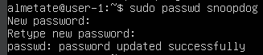
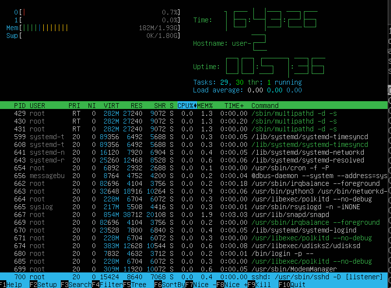

## Part 1. Установка ОС

скачиваем и устанавливаем VirtualBox для Windows 11 и скачиваем Ubuntu 20.04 Server LTS без графического интерфейса с официального сайта. В VirtualBox создаем новую виртуальную машину, выделяем место на диске и ставим Убунту.

Текущая версия убунты находится в файле `/etc/issue`.
Соответсвенно посмотреть её можно с использованием команды `cat`:

---

## Part 2. Создание пользователя

* `useradd` - команда создания нового пользователя, с флагом `[-g] GROOP` можно добавить в определенную группу:

* `/etc/passwd` — файл, содержащий в текстовом формате список пользовательских учётных записей. увидеть добаленного пользователя можно в конце списка:

---
## Part 3. Настройка сети ОС

1) Название машины находится в файле `/etc/hostname`. Изменить Название машины можно с помощью `sudo hostnamectl set-hostname user-1`.

2) Затем с помощью команды:

    `sudo timedatectl set-timezone`

устанавливаем часовой пояс. Проверить успешность настройки можно командой `date` или `timedatectl`.

3) Далее мы будем работать с командой ip. Чтобы увидеть названия сетевых интерфейсов воспольнуемся командой ip link или ifconfig:

папки каждого сетевого интерфейса находятся по адрессу `/sys/class/net/`
    > lo (loopback device) – виртуальный интерфейс, присутствующий по умолчанию в любом Linux. Он используется для отладки сетевых программ и запуска серверных приложений на локальной машине. С этим интерфейсом всегда связан адрес 127.0.0.1. У него есть dns-имя – localhost. Посмотреть привязку можно в файле /etc/hosts.

4) ip адрес устройства можно узнать с помощью команды `hostname -I`.

    

    > DHCP (англ. Dynamic Host Configuration Protocol — протокол динамической настройки узла) — прикладной протокол, позволяющий сетевым устройствам автоматически получать IP-адрес и другие параметры, необходимые для работы в сети TCP/IP. Данный протокол работает по модели «клиент-сервер». Сетевой администратор может задать диапазон адресов, распределяемых сервером среди компьютеров. Протокол DHCP используется в большинстве сетей TCP/IP.
5) ip адрес по умолчанию (внутренний IP-адрес шлюза (`gw`)) узнаем из команды ip route:

    

    Узнать внешний ip адрес можно только с помощью стороннего веб-сайта. Воспользуемся `curl` - командой для получения HTML кода указанной страницы. Сайт `curlmyip.ru` представляет из себя одну строчку из внешнего ip.

    

6) В Ubuntu 20.04 для настройки сети используется утилита `netplan`. Ее конфигурационный файл находится в директории `/etc/netplan` и имеет расширение ".yaml". C правами администратора вносим изменения в файл `/etc/netplan/00-installer-config.yaml`

до изменений:

Устанавливаем значение «dhcp4» на «no«, чтобы отключить протокол DHCP, и указываем статический IP-адрес интерфейса следующим образом:

    - указываем статический IP адрес (IPv4), который будет назначен сетевому интерфейсу `addresses: [10.0.2.16/24]`
    - указываем шлюз `gateway4: 10.0.2.3`
    - В разделе `nameservers` указываем DNS или IP — адреса серверов имен и IP-адрес маршрутизатора

    
    Чтобы зафиксировать изменения, выполняем команду `sudo netplan apply`.

7) Перезагружаем виртуальную машину командой `sudo reboot` и проверяем, сохранились ли настройки.

    

    Проверяем, что изменения отобразились в выводах команды ip. Видим, что теперь адрес шлюза задан статически, а не получен динамически от dhcp-сервера. Также видим измененный ip-адрес.

    

    Пингуем ya.ru и 1.1.1.1 с помощью команды ping.

    

---
## Part 4. Обновление ОС

Команда для синхронизации индекса пакетов из репозиториев:

    sudo apt-get update

Команда для установки самых новых версий пакетов:

    sudo apt-get upgrade

После установки введем sudo apt-get upgrade еще раз и увидим, что пакетов, подлежащих обновлению, не осталось.

---
## Part 5. Использование команды sudo

Чтобы разрешить пользователю выполнять команду sudo, нужно добавить его в группу sudo. Для этого от имени администратора выполним команду usermod с опциями -a (--append, добавляет пользователя в дополнительные группы) и -G (--groups, список дополнительных групп).

Команда sudo предоставляет возможность пользователям выполнять команды от имени суперпользователя root.

> Root или суперпользователь — это специальный аккаунт и группа пользователей в UNIX-подобных системах с идентификатором пользователя UID 0, владелец которого имеет право на выполнение всех без исключения операций.
Чтобы сменить пользователя, нужно ввести команду su - <имя пользователя>. Перед этим мне понадобилось установить пароль для созданного в Part 2 пользователя с помощью команды sudo passwd <имя пользователя>.

Сменив пользователя, редактируем /etc/hostname.

Перезапускаем виртуальную машину и видим внесенные изменения.

---
## Part 6. Установка и настройка службы времени

Чтобы включить автоматическую синхронизацию времени, нужно ввести команду `sudo timedatectl set-ntp on`.

## Part 7. Установка и использование текстовых редакторов

---
**VIM**

---

1. 
    Нажать i.
    Вписать ник
    Нажать ESC, затем :, затем набрать wq и нажать Enter
2. 
    Выход без сохранения: Вместо wq пишим q!
3. 
    Поиск: Без перехода в режим вставки, нажать /<текст поиска
4.  
    Замена: Без перехода в режим вставки, нажать :s/<текст поиска>/<текст замены>

---
**NANO**

---
1. 
    Вписать ник.
    Нажать Ctrl + O, Enter, затем Ctrl + X
2. 
    Выход без сохранения: Нажать Ctrl + X, затем N
3. 
    Поиск: Ctrl + W
4.  
    Замена: Ctrl + /, затем то что хотим поменять - ENTER, затем на то что хотим поменять - ENTER.

---
**MCEDIT**

---
1. 
    Вписать ник.
    Нажать F10 выбрать "yes" или "да"
2. 
    Выход без сохранения: Выбрать "no" или "нет"
3. 
    Поиск: F7
4.  
    Замена: F4

## Part 8. Установка и базовая настройка сервиса SSHD

Команды для установки SSH и добавления его в автозагрузку:

    sudo apt install openssh-server
    sudo systemctl enable ssh

Порт по умолчанию - 22. Для того, чтобы его изменить, нужно отредактировать файл /etc/ssh/sshd_config, указав нужный номер напротив слова Port. По умолчанию строки записаны в виде комментариев, с символом #. нужно раскоментировать.

> ps (от англ. process status) — программа в Unix-подобных операционных системах, выводящая отчёт о работающих процессах.

**Ключи команды `ps`:**
* `-A`, `-e` - выбрать все процессы  
* `-a` - выбрать все процессы, кроме фоновых  
* `-d` - выбрать все процессы, даже фоновые, кроме процессов сессий  
* `-N` - выбрать все процессы кроме указанных  
* `-С` - выбирать процессы по имени команды  
* `-G` - выбрать процессы по ID группы  
* `-p` - выбрать процессы PID  
* `--ppid` - выбрать процессы по PID родительского процесса  
* `-s` - выбрать процессы по ID сессии  
* `-t` - выбрать процессы по tty  
* `-u` - выбрать процессы пользователя  
* `-x` - найти все вхождения строки поиска

Чтобы не искать процесс sshd вручную, можно также воспользоваться grep.

Перезапускаем систему с помощью команды `sudo reboot`
вывод команды `netstat -tan`:

> netstat (network statistics) — утилита командной строки, выводящая на дисплей состояние TCP-соединений (как входящих, так и исходящих), таблицы маршрутизации, число сетевых интерфейсов и сетевую статистику по протоколам. Основное назначение утилиты — поиск сетевых проблем и определение производительности сети.

**Используемые в задании ключи:**

- -t (--tcp) - показывать только TCP порты.
- -a (--all) - показывать состояние всех сокетов.
- -n (--numeric) - показывать сетевые адреса как числа (например 127.0.0.53:53 вместо localhost:domain)

    > Сокет (англ. socket — разъём) — название программного интерфейса для обеспечения обмена данными между процессами. Для взаимодействия между машинами с помощью стека протоколов TCP/IP используются адреса и порты. Адрес представляет собой 32-битную структуру для протокола IPv4, 128-битную для IPv6. Номер порта — целое число в диапазоне от 0 до 65535 (для протокола TCP). Эта пара определяет сокет («гнездо», соответствующее адресу и порту). В процессе обмена, как правило, используется два сокета — сокет отправителя и сокет получателя.
**Значения столбцов:**
- ***Proto*** -	протокол, используемый сокетом. Так как была использована опция [-t|--tcp], в выводе пристутвуют только TCP-сокеты.
- ***Recv-Q*** - счётчик байт, не скопированных программой пользователя из этого сокета.
- ***Send-Q*** - счётчик байтов, не подтверждённых удалённым узлом.
- ***Local Address*** - адрес и номер порта локального конца сокета. Если указана опция [-n|--numeric], вывод в формате [адрес сокета:номер порта], иначе - [каноническое имя узла:соответствующее имя службы]. В интересующей нас строчке 0.0.0.0 - адрес локального конца сокета, 2022 - номер порта, который мы поменяли с 22 на 2022. Адрес 0.0.0.0 означает, что удаленный конец сокета будет доступен всем локальным ip-адресам.
- ***Foreign Address*** - адрес и номер порта удалённого конца сокета.
- ***State*** - состояние сокета. Состояние LISTEN означает, что сокет ожидает входящих подключений.

---
## Part 9. Установка и использование утилит top, htop

Информация о состоянии системы из вывода утилиты top (Table Of Processes):

- **uptime (как долго работает система)** - 1 минута
- **количество авторизированных пользователей** - 1
- **общая загрузка системы** 
представленна в виде средних значений за 1, 5, 15 минут

- **общее количество процессов** - 116
- **загрузка cpu** загрузка cpu - 0.4%, среди которых 0.0% отведён под пользовательские процессы (us), 0.2% под процессы ядра(sy), 0.0% под ожидание завершения ввода\вывода (wa), 0.2% под обработку программных прерываний (si).

- **загрузка памяти** - всего есть 1975,8 мегабайт оперативной памяти: из них 180,3 используется, 1498,4 свободно, 297,1 занимает кэш системы.

- **PID процесса, занимающего больше всего памяти** - 667, сортируем с комбинацией SHIFT + M: 

- **PID процесса, занимающего больше всего процессорного времени** - 1028, сортируем с комбинацией SHIFT + T:

Работа с утилитой htop:

- Сортировка(F6):
    - по PID:

        

    - по PERCENT_CPU:

        

    - по PERCENT_MEM:

        

    - по TIME:

        

- Фильтрация (F4) для процесса sshd:

    

- Поиск (F3) процесса syslog:

    

- С выводом hostname, clock и uptime (настройка вывода F2):

    

---
## Part 10. Использование утилиты fdisk

    sudo fdisk -l

**Имя:** /dev/sda

**Размер:** 16 гибибайт

**Количество секторов:** 33554432

**Размер swap:** 1.8 гБ (`free -h`)

---
## Part 11. Использование утилиты df

Корневой раздел (/):
- Информация из команды df:

    
    
    - **размер раздела** - 10218772
    - **размер занятого пространства** - 5225200
    - **размер свободного пространства** - 4452900
    - **процент использования** - 54%

    Используемая единица измерения - килобайты.

- Информация из команды df -Th:

    

    - **размер раздела** - 9.8 Гб
    - **размер занятого пространства** - 5.0 Гб
    - **размер свободного пространства** - 4.3 Гб
    - **процент использования** - 54%

    Тип файловой системы - ext4.

---
## Part 12. Использование утилиты du

Вывод du для /home, /var, /var/log сначала в байтах, затем в человекочитаемом виде.

Размер всего содержимого - `sudo du -s -h /var/log/*`.

---
## Part 13. Установка и использование утилиты ncdu

    sudo apt install ncdu
    sudo ncdu /

Для навигации среди списка директорий используются стрелки, Enter для выбора.

Сравнение вывода du и ncdu:

|            | du          | ncdu       |
| :---       |    :----:   |       ---: |
| /home      | 152 КiB     | 156 KiB    |
| /var       | 950 МiB     | 949,4 MiB  |
| /var/log   | 206 МiB      | 205.4 Mib   |

---
## Part 14. Работа с системными журналами

***/var/log/dmesg*** содержит информацию о драйверах устройств.

***/var/log/syslog*** содержит глобальный системный журнал, в котором пишутся сообщения от ядра Linux, различных служб, сетевых интерфейсов и т.д. с момента запуска системы.

***/var/log/auth.log***  — информация об авторизации пользователей, включая удачные и неудачные попытки входа в систему, а также задействованные механизмы аутентификации.

Используя редактор mcedit и введя поиск по login видим, что последняя успешная авторизация была выполнена 26 октября в 17:35:02 пользователем weaveryu. Метод входа называется LOGIN.

Перезапуск ssh:

    sudo systemctl restart sshd

Сообщения о перезапуске в /var/log/syslog:

---
## Part 15. Использование планировщика заданий CRON

Команда для редактирования конфигурационного файла cron активного пользователя:
    
    crontab -e

Посмотреть этот файл: 

    crontab -l

Записи в /var/log/syslog:

Удаление конфигурационного файла:

    crontab -r

Попытка вывести список задач после удаления:

